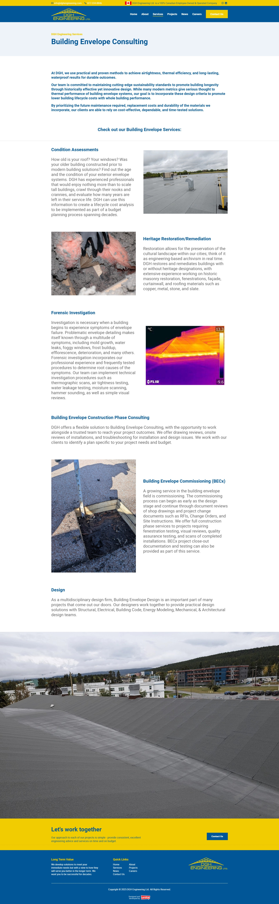

# Case Study - DGH Engineering Webpage Design

During my time at DGH Engineering Ltd., I collaborated with a Certified Engineering Technologist (CET) and a Registered Roof Observer (RRO) to develop a new Building Envelope Consulting webpage. Building Envelope services focus on the performance and durability of exterior systems, including roofs, walls, windows, and foundations.

Subject matter experts provided detailed technical terminology and service descriptions, which I translated into clear, user-focused web content. I applied UX/UI principles to structure the page, integrating concise text and supporting visuals aligned with management’s marketing objectives. Management direction emphasized prioritizing essential information and leveraging larger imagery to improve user engagement and readability. 

